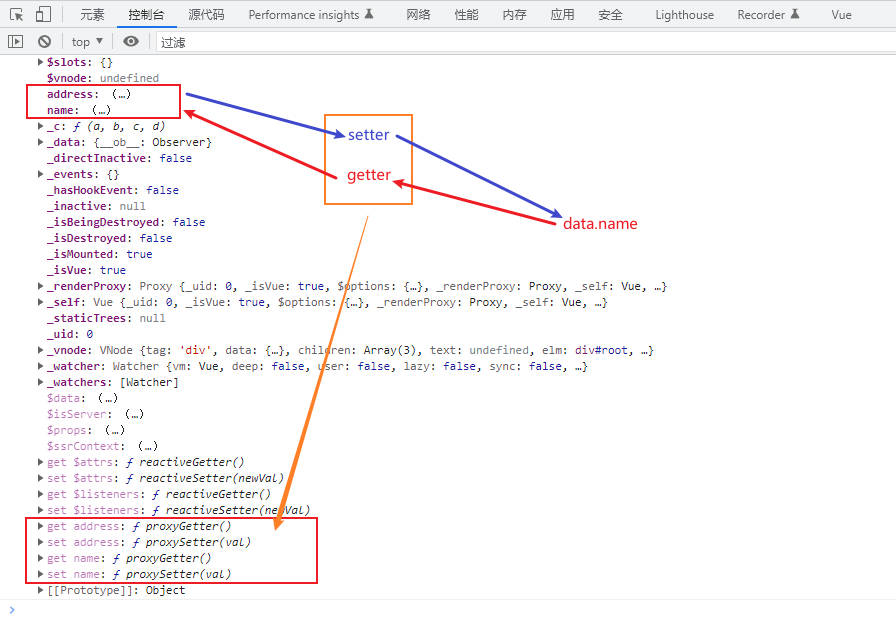
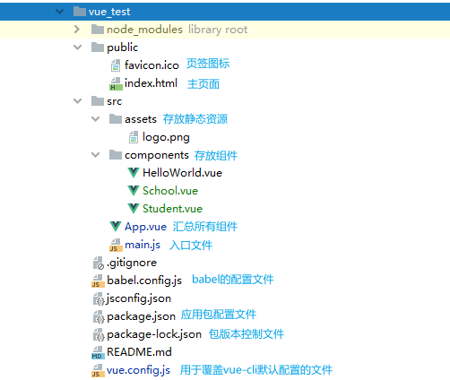

# Vue2


前置JavaScript基础知识

- ES6语法规范
- ES6模块化
- 包管理器：npm、yarn、cnpm 任一
- 原型、原型链
- 数组常用方法
- axios
- promise


## 搭建Vue开发环境

**一、引入Vue**


**二、安装vue-devtools**

访问Google应用商店：[下载GoogleHelper](http://googlehelper.net/)

使用步骤：解压、更改后缀名crx为zip、解压zip到一个文件夹中、将此文件夹拖至Chrome扩展应用程序、注册GoogleHelper账号、激活并使用

在Google应用商店中添加`Vuejs devtools`扩展程序


**三、关闭Vue.js中控制台提示**


```html
<script type="text/javascript">
    // 阻止 vue 在启动时生成生产提示
    Vue.config.productionTip = false;
</script>
```

详细参考：https://cn.vuejs.org/v2/api/ 全局配置


## 初识Vue

==初识Vue.html==

```html
<!doctype html>
<html lang="en">
<head>
    <meta charset="UTF-8">
    <meta name="viewport"
          content="width=device-width, user-scalable=no, initial-scale=1.0, maximum-scale=1.0, minimum-scale=1.0">
    <meta http-equiv="X-UA-Compatible" content="ie=edge">
    <title>初识Vue</title>
    <link rel="icon" href="../favicon.ico">
    <!--引入Vue-->
    <script type="text/javascript" src="../js/vue.js"></script>
</head>
<body>
<!--
    初识Vue：
        1.想让Vue工作，就必须创建一个Vue实例，且要传入一个配置对象
        2.root容器里的代码依然符合html规范，只不过混入了一些特殊的Vue语法
        3.root容器里的代码被称为【Vue模板】
-->
<!--准备好一个容器-->
<div id="root">
    <!--此处使用了Vue中的插值语法-->
    <h1>Hello {{name}}!</h1>
</div>

<script type="text/javascript">
    // 阻止 vue 在启动时生成生产提示
    Vue.config.productionTip = true;

    // 创建Vue实例
    new Vue({
        el: '#root', //el用于指定当前Vue实例为哪个容器服务，值通常为css选择器字符串
        data: { //data中用于存储数据，数据供el所指定的容器去使用，值暂时先写成一个对象
            name: '雨木林风'
        }
    });
</script>
</body>
</html>
```

分析：

1、容器和Vue实例是**一一对应**的，实际开发中只有一个Vue实例，并且会配合着组件一起使用

2、插值语法的`{{xxx}}`中xxx必须写**JS表达式**（一个表达式会生成一个值，可以放在任何一个需要值的地方）

3、一旦data中的数据发生改变，那么模板中用到该数据的地方也会自动更新


## Vue的模板语法

Vue模板语法有2大类：

1.插值语法

​		功能：用于解析标签体内容

​		写法：`{{xxx}}`，xxx是js表达式，且可以直接读取到data中的所有属性

2.指令语法

​		功能：用于解析标签（包括：标签属性、标签体内容、绑定事件...）

​		举例：`v-bind:href="xxx"` 或简写为 `:href="xxx"`，xxx同样要写js表达式，且可以直接读取到data中的所有属性

​		备注：Vue中有很多的指令，且形式都是`v-???`，此处我们只以`v-bind`举例；只有`v-bind`可以简写为`:`

==模板语法.html==

```html
<!DOCTYPE html>
<html lang="en">
<head>
    <meta charset="UTF-8">
    <title>模板语法</title>
    <script type="text/javascript" src="../js/vue.js"></script>
</head>
<body>
<div id="root">
    <h1>插值语法</h1>
    <h3>你好，{{name}}</h3>
    <hr/>
    <h1>指令语法</h1>
    <a :href="school.url">点我去{{school.name}}</a>
</div>
<script type="text/javascript">
    Vue.config.productionTip = false;

    new Vue({
        el: '#root',
        data: {
            name: 'jack',
            school: {
                name: '百度',
                url: 'http://www.baidu.com'
            }
        }
    })
</script>
</body>
</html>
```


## 数据绑定

Vue中有2种数据绑定的方式：

1.单项绑定（v-bind）：数据只能从data流向页面

2.双向绑定（v-model）：数据不仅能从data流向页面，还可以从页面流向data

备注：

- 双向绑定一般都应用在表单类元素上（如：input、select等）
- v-model:value 可以简写为 v-model，因为v-model默认收集的就是value的值

==数据绑定.html==

```html
<!DOCTYPE html>
<html lang="en">
<head>
    <meta charset="UTF-8">
    <title>数据绑定</title>
    <script type="text/javascript" src="../js/vue.js"></script>
</head>
<body>
<div id="root">
    <!--普通写法-->
    单向数据绑定：<input type="text" v-bind:value="name"><br>
    双向数据绑定：<input type="text" v-model:value="name"><br>

    <!--简写-->
    单向数据绑定：<input type="text" :value="name"><br>
    双向数据绑定：<input type="text" v-model="name"><br>

    <!--如下代码是错误的，因为v-model只能应用在表单类元素（输入类元素）上-->
    <!--<h2 v-model:x="name">Hello</h2>-->
</div>

<script type="text/javascript">
    Vue.config.productionTip = false;

    new Vue({
        el: '#root',
        data: {
            name: 'jack'
        }
    })
</script>
</body>
</html>
```


## el与data的两种写法

1.el有2种写法

- new Vue时候配置el属性
- 先创建Vue实例，随后通过vm.$mount('#root')指定el的值

2.data有2种写法

- 对象式
- 函数式

如何选择：目前哪种写法都可以，以后学习到组件时，data必须使用函数式，否则会报错

3.<span style="color:red;">一个重要的原则</span>：由Vue管理的函数，一定不要写箭头函数，一旦写了箭头函数，this就不再是Vue实例了。

==el与data的两种写法.html==

```html
<!DOCTYPE html>
<html lang="en">
<head>
    <meta charset="UTF-8">
    <title>el与data的两种写法</title>
    <script type="text/javascript" src="../js/vue.js"></script>
</head>
<body>
<div id="root">
    <h1>你好，{{name}}</h1>
</div>

<script type="text/javascript">
    Vue.config.productionTip = false;

    //el的两种写法
    /*const v = new Vue({
        // el: '#root', //第一种写法
        data: {
            name: 'SpringStone',
        }
    });

    setTimeout(() => {
        v.$mount('#root') // 第二种写法
    }, 1000)*/

    //data的两种写法
    new Vue({
        el: '#root',
        //data的第一种写法：对象式
        /*data: {
            name: 'SpringStone'
        }*/

        // data的第二种写法：函数式（不要写箭头函数）
        data() {
            console.log('@@@', this) //此处的this是Vue实例对象
            return {
                name: 'SpringStone'
            }
        }
    })
</script>
</body>
</html>
```


## MVVM模型

M：模型，Model，对应data中的数据

V：视图，View，模板代码

VM：视图模型，ViewModel，Vue实例对象（因此接收实例的变量名通常为**vm**）


==Vue中的MVVM.html==

```html
<!DOCTYPE html>
<html lang="en">
<head>
    <meta charset="UTF-8">
    <title>理解MVVM</title>
    <script src="../js/vue.js"></script>
</head>
<body>
<div id="root">
    <h1>学校名称：{{name}}</h1>
    <h1>学校地址：{{address}}</h1>
</div>

<script>
    Vue.config.productionTip = false;

    const vm = new Vue({
        data: {
            name: 'SpringStone',
            address: '江苏'
        }
    })

    vm.$mount('#root')
</script>
</body>
</html>
```

总结：

1、data中的所有属性，最后都出现在了vm身上（*数据代理*）

2、vm身上的所有属性，及Vue原型（prototype）上的所有属性，在Vue模板中都可以直接使用


## 数据代理

Object.defineProperty 方法

```html
<!DOCTYPE html>
<html lang="en">
<head>
    <meta charset="UTF-8">
    <title>回顾Object.defineProperty方法</title>
</head>
<body>
<script>
    let number = 18
    let person = {
        name: '张三',
        gender: '男',
        // age: 18
    }

    //通过这种方式添加的对象属性不会参与枚举（遍历）
    Object.defineProperty(person, 'age', {
        // value: 18,
        // enumerable: true, //控制属性是否可以枚举，默认false
        // writable: true, //控制属性是否可以被修改，默认false
        // configurable: true, //控制属性是否可以被删除，默认false

        //当有人读取person的age属性时，get函数（getter）就会被调用，且返回值就是age的值
        get() {
            console.log('有人读取age属性了')
            return number
        },

        //当有人修改person的age属性时，set函数（setter）就会被调用，且会收到修改的具体值
        set(v) {
            console.log('有人修改了age属性，且值为', v)
            number = v
        }
    })

    // console.log(Object.keys(person))

    // console.log(person)
</script>
</body>
</html>
```

数据代理（obj2就是obj的数据代理）

```html
<!DOCTYPE html>
<html lang="en">
<head>
    <meta charset="UTF-8">
    <title>何为数据代理</title>
</head>
<body>
<!--数据代理：通过一个对象代理，对另一个对象中的属性的操作（读/写）-->
<script>
    let obj = {x: 100}
    let obj2 = {y: 200}

    Object.defineProperty(obj2, 'x', {
        get() {
            return obj.x
        },

        set(v) {
            obj.x = v
        }
    })
</script>
</body>
</html>
```

Vue中的数据代理（Vue实例就是data的数据代理）



```html
<!DOCTYPE html>
<html lang="en">
<head>
    <meta charset="UTF-8">
    <title>Vue中的数据代理</title>
    <script src="../js/vue.js"></script>
</head>
<body>
<!--
    1.Vue中的数据代理：
        通过vm对象来代理data对象中属性的操作（读/写）
    2.Vue中数据代理的好处：
        更加方便的操作data中的数据
    3.基本原理：
        通过Object.defineProperty()把data对象中所有属性添加到vm上。
        为每一个添加到vm上的属性，都指定一个getter/setter。
        在getter/setter内部去操作（读/写）data中对应的属性。
-->
<div id="root">
    <h2>学校名称：{{name}}</h2>
    <h2>学校地址：{{address}}</h2>
</div>

<script>
    Vue.config.productionTip = false;

    const vm = new Vue({
        data() {
            return {
                name: 'SpringStone',
                address: 'China'
            }
        }
    })

    vm.$mount('#root')
</script>
</body>
</html>
```

Vue实例中的data是以**_data**存储的


## 事件处理

==事件的基本使用.html==

```html
<!DOCTYPE html>
<html lang="en">
<head>
    <meta charset="UTF-8">
    <title>事件的基本使用</title>
    <script src="../js/vue.js"></script>
</head>
<body>
<!--
    事件的基本使用：
        1.使用 v-on:xxx 或 @xxx 绑定事件，其中xxx是事件名；
        2.事件的回调需要配置在methods对象中，最终会在vm上；
        3.methods中配置的函数，不要用箭头函数！否则this就不是vm了；
        4.methods中配置的函数，都是被Vue所管理的函数，this的指向是vm或组件实例对象；
        5.@click="demo" 和 @click="demo($event)" 效果一致，但后者可以传参；
-->
<div id="root">
    <h2>欢迎来到{{name}}</h2>
    <!--<button v-on:click="showInfo">点我提示信息</button>-->
    <button @click="showInfo">点我提示信息（不传参）</button>
    <button @click="showInfo2($event, 66)">点我提示信息2（传参）</button>
</div>

<script>
    Vue.config.productionTip = false;
    const vm = new Vue({
        el: '#root',
        data: {
            name: 'China'
        },
        methods: {
            showInfo(event) {
                // console.log(event)
                // console.log(event.target.innerText)
                // console.log(this === vm) //此处的this是vm
                alert('同学你好！')
            },
            showInfo2(event, number) {
                console.log(event)
                console.log(number)
                alert('同学你好！！')
            }
        }
    })
</script>
</body>
</html>
```

==事件修饰符.html==

```html
<!DOCTYPE html>
<html lang="en">
<head>
    <meta charset="UTF-8">
    <title>事件修饰符</title>
    <script src="../js/vue.js"></script>
    <style>
        * {
            margin-top: 20px;
        }

        .demo1 {
            height: 50px;
            background-color: skyblue;
        }
        .box1 {
            padding: 5px;
            background-color: skyblue;
        }

        .box2 {
            padding: 5px;
            background-color: orange;
        }

        .list {
            width: 200px;
            height: 200px;
            background-color: peru;
            overflow: auto;
        }

        li {
            height: 100px;
        }
    </style>
</head>
<body>
<!--
    Vue中的事件修饰符：
        1.prevent：阻止默认事件（常用）；
        2.stop：阻止事件冒泡（常用）；
        3.once：事件只触发一次（常用）；
        4.capture：使用事件的捕获模式；
        5.self：只有event.target是当前操作的元素时才触发事件；
        6.passive：事件的默认行为立即执行，无需等待事件回调执行完毕；
	事件修饰符可以连写：@click.stop.prevent
-->
<div id="root">
    <h2>欢迎来到{{name}}学习</h2>
    <!--阻止默认事件-->
    <a href="http://www.baidu.com" @click.prevent="showInfo">点我提示信息</a>
    <!--阻止事件冒泡-->
    <div class="demo1" @click="showInfo">
        <button @click.stop="showInfo">点我提示信息</button>
    </div>
    <!--事件只触发一次-->
    <button @click.once="showInfo">点我提示信息</button>
    <!--使用事件的捕获模式-->
    <div class="box1" @click.capture="showMsg(1)">
        div1
        <div class="box2" @click="showMsg(2)">div2</div>
    </div>
    <!--只有event.target是当前操作的元素时才触发事件-->
    <div class="demo1" @click.self="showInfo">
        <button @click="showInfo">点我提示信息</button>
    </div>

    <!--事件的默认行为立即执行，无需等待事件回调执行完毕-->
    <ul @wheel.passive="demo" class="list">
        <li>1</li>
        <li>2</li>
        <li>3</li>
        <li>4</li>
    </ul>
</div>

<script>
    Vue.config.productionTip = false;

    new Vue({
        el: '#root',
        data: {
            name: 'China'
        },
        methods: {
            showInfo(event) {
                // console.log(event.target)
                alert('同学你好')
            },
            showMsg(msg) {
                console.log(msg)
            },
            demo() {
                for (let i = 0; i < 100000; i++) {
                    console.log('#')
                }

                console.log('累坏了')
            }
        }
    })
</script>
</body>
</html>
```

==键盘事件.html==

```html
<!DOCTYPE html>
<html lang="en">
<head>
    <meta charset="UTF-8">
    <title>键盘事件</title>
    <script src="../js/vue.js"></script>
</head>
<body>
<!--
    1.Vue中常用的按键别名：
        enter
        delete（包括“删除”和“退格”键）
        esc
        space
        tab（特殊，必须配合keydown去使用）
        up
        down
        left
        right

    2.Vue未提供别名的按键，可以使用按键原始key值去绑定，但注意要转为kebab-case（短横线命名）
        CapsLock ==> caps-lock

    3.系统修饰键（用法特殊）：ctrl、alt、shift、meta
        （1）配合keyup使用：按下修饰键的同时，再按下其他键，随后释放其他键，事件才会触发
			可以连写来指定按键：keyup.ctrl.y
        （2）配合keydown使用：正常触发事件

    4.也可以使用keyCode去指定具体的按键（不推荐）

    5.Vue.config.keyCodes.自定义键名 = 键码，可以去指定按键别名
-->
<div id="root">
    <h2>欢迎来到{{name}}学习</h2>
    <input type="text" placeholder="按下回车提示输入" @keydown.ctrl="showInfo">
</div>

<script>
    Vue.config.productionTip = false;
    new Vue({
        el: '#root',
        data: {
            name: 'China'
        },
        methods: {
            showInfo(e) {
                // if (e.key !== 'Enter') return
                console.log(e.target.value)
            }
        }
    })
</script>
</body>
</html>
```


## 计算属性

==姓名案例_插值语法实现.html==

```html
<!DOCTYPE html>
<html lang="en">
<head>
    <meta charset="UTF-8">
    <title>姓名案例_插值语法实现</title>
    <script src="../js/vue.js"></script>
</head>
<body>
<div id="root">
    姓：<input type="text" v-model="firstName">
    <br>
    名：<input type="text" v-model="lastName">
    <br>
    <!--插值语法中的表达式应尽量简洁-->
    全名：<span>{{firstName.slice(0,3)}}-{{lastName}}</span>
</div>
<script>
    Vue.config.productionTip = false;

    new Vue({
        el: '#root',
        data: {
            firstName: '张',
            lastName: '三'
        }
    })
</script>
</body>
</html>
```

==姓名案例_methods实现.html==

```html
<!DOCTYPE html>
<html lang="en">
<head>
    <meta charset="UTF-8">
    <title>姓名案例_methods实现</title>
    <script src="../js/vue.js"></script>
</head>
<body>
<div id="root">
    姓：<input type="text" v-model="firstName"><br>
    名：<input type="text" v-model="lastName"><br>
    全名：<span>{{fullName()}}</span>
</div>

<script>
    Vue.config.productionTip = false;

    new Vue({
        el: '#root',
        data: {
            firstName: '张',
            lastName: '三'
        },
        methods: {
            fullName() {
                return this.firstName + '-' + this.lastName
            }
        }
    })
</script>
</body>
</html>
```

==姓名案例_计算属性实现.html==

```html
<!DOCTYPE html>
<html lang="en">
<head>
    <meta charset="UTF-8">
    <title>姓名案例_计算属性实现</title>
    <script src="../js/vue.js"></script>
</head>
<body>
<!--
    计算属性：
        1.定义：要用的属性不存在，要通过已有属性计算得来
        2.原理：底层借助了Object.defineProperty方法提供的getter和setter
        3.get函数何时执行？
            （1）初次读取时会执行一次
            （2）当依赖的数据发生改变时会被再次调用
        4.优势：与methods实现相比，内部有缓存机制（复用），效率更高，调试方便
        5.备注：
            （1）计算属性最终会出现在vm上，直接读取使用即可
            （2）如果计算属性要被修改，那必须写set函数去响应修改，且set中要引起计算时依赖的数据发生改变
-->
<div id="root">
    姓：<input type="text" v-model="firstName"><br>
    名：<input type="text" v-model="lastName"><br>
    全名：{{fullName}}
    全名：{{fullName}}
    全名：{{fullName}}
    全名：{{fullName}}
    全名：{{fullName}}
</div>

<script>
    Vue.config.productionTip = false;

    const vm = new Vue({
        el: '#root',
        data: {
            firstName: '张',
            lastName: '三'
        },
        computed: {
            fullName: {
                //get有什么作用？当有人读取fullName时，get就会被调用，且返回值就作为fullName的值
                //get何时被调用？1.初次读取fullName时；2.所依赖的数据发生变化时；
                get() {
                    console.log('get被调用了')
                    // console.log(this) //此处的this是vm
                    return this.firstName + '-' + this.lastName
                },
                //set何时被调用？当fullName被修改时
                set(value) {
                    console.log('set', value)
                    const arr = value.split('-')
                    this.firstName = arr[0]
                    this.lastName = arr[1]
                }
            }
        }
    })
</script>
</body>
</html>
```

==姓名案例_计算属性简写.html==

```html
<!DOCTYPE html>
<html lang="en">
<head>
    <meta charset="UTF-8">
    <title>姓名案例_计算属性简写</title>
    <script src="../js/vue.js"></script>
</head>
<body>
<div id="root">
    姓：<input type="text" v-model="firstName"><br>
    名：<input type="text" v-model="lastName"><br>
    <span>{{fullName}}</span>
</div>

<script>
    Vue.config.productionTip = false;

    const vm = new Vue({
        el: '#root',
        data: {
            firstName: '张',
            lastName: '三'
        },
        computed: {
            //计算属性的简写形式前提：只读不改，set一定是被省略的
            fullName() {
                return this.firstName + '-' + this.lastName
            }
        }
    })
</script>
</body>
</html>
```


## 监视属性

==天气案例.html==

```html
<!DOCTYPE html>
<html lang="en">
<head>
    <meta charset="UTF-8">
    <title>天气案例</title>
    <script src="../js/vue.js"></script>
</head>
<body>
<div id="root">
    <h2>今天天气很{{info}}</h2>
    <button @click="changeWeather">切换天气</button>
    <!--绑定事件的时候：@xxx="yyy" yyy可以写一些简单的语句-->
    <!--<button @click="isHot = !isHot">切换天气</button>-->
</div>

<script>
    Vue.config.productionTip = false;
    const vm = new Vue({
        el: '#root',
        data: {
            isHot: true
        },
        computed: {
            info() {
                return this.isHot?'很炎热':'很凉爽'
            }
        },
        methods: {
            changeWeather() {
                this.isHot = !this.isHot
            }
        }
    })
</script>
</body>
</html>
```

==天气案例_监视属性.html==

```html
<!DOCTYPE html>
<html lang="en">
<head>
    <meta charset="UTF-8">
    <title>天气案例_监视属性</title>
    <script src="../js/vue.js"></script>
</head>
<body>
<!--
    监视属性watch：
        1.当被监视的属性变化时，回调函数自动调用，进行相关操作
        2.监视的属性必须存在，才能进行监视！！
        3.监视的两种写法：
            （1）new Vue时传入watch配置
            （2）通过vm.$watch监视
-->
<div id="root">
    <h2>今天天气很{{info}}</h2>
    <button @click="changeWeather">切换天气</button>
</div>

<script>
    Vue.config.productionTip = false;

    const vm = new Vue({
        el: '#root',
        data: {
            isHot: true
        },
        computed: {
            info() {
                return this.isHot?'很炎热':'很凉爽'
            }
        },
        methods: {
            changeWeather() {
                this.isHot = !this.isHot
            }
        },
        watch: {
            info: {
                immediate: true, //初始化时调用一次handler
                //handler何时调用？当isHot发生改变时
                handler(newValue, oldValue) {
                    console.log('info被修改了', newValue, oldValue)
                }
            },
            // isHot: {
            //     handler(newValue, oldValue) {
            //         console.log('isHot被修改了', newValue, oldValue)
            //     }
            // }
        }
    })

    vm.$watch('isHot', {
        immediate: true,
        handler(newValue, oldValue) {
            console.log('isHot被修改了', newValue, oldValue)
        }
    })
</script>
</body>
</html>
```

==天气案例_深度监视.html==

```html
<!DOCTYPE html>
<html lang="en">
<head>
    <meta charset="UTF-8">
    <title>天气案例_深度监视</title>
    <script src="../js/vue.js"></script>
</head>
<body>
<!--
    深度监视：
        （1）Vue中的watch默认不监测对象内部值的改变（一层）
        （2）配置deep:true可以监测对象内部值改变（多层）
    备注：
        （1）Vue自身可以监测对象内部值的改变，但Vue提供的watch默认不可以！
        （2）使用watch时根据数据的具体结构，决定是否采用深度监视
-->
<div id="root">
    <h2>今天天气很{{info}}</h2>
    <button @click="changeWeather">切换天气</button>
    <hr>
    <h3>a的值是{{numbers.a}}</h3>
    <button @click="numbers.a++">a+1</button>
    <h3>b的值是{{numbers.b}}</h3>
    <button @click="numbers.b++">b+1</button>
</div>
<script>
    Vue.config.productionTip = false;

    const vm = new Vue({
        el: '#root',
        data: {
            isHot: true,
            numbers: {
                a: 1,
                b: 1
            }
        },
        computed: {
            info() {
                return this.isHot ? '很炎热' : '很凉爽'
            }
        },
        methods: {
            changeWeather() {
                this.isHot = !this.isHot
            }
        },
        watch: {
            isHot: {
                handler(newValue, oldValue) {
                    console.log('isHot被修改了', newValue, oldValue)
                }
            },
            //监视多级结构中某个属性的变化
            'numbers.a': {
                handler() {
                    console.log('a has changed')
                }
            },
            //监视多级结构中所有属性的变化
            numbers: {
                deep: true, //开启深度监视
                handler() {
                    console.log('numbers中的值被修改了')
                }
            }
        }
    })
</script>
</body>
</html>
```

==天气案例_简写监视属性.html==

```html
<!DOCTYPE html>
<html lang="en">
<head>
    <meta charset="UTF-8">
    <title>天气案例_简写监视属性</title>
    <script src="../js/vue.js"></script>
</head>
<body>
<div id="root">
    <h2>今天天气很{{info}}</h2>
    <button @click="changeWeather">切换天气</button>
</div>

<script>
    Vue.config.productionTip = false;
    const vm = new Vue({
        el: '#root',
        data: {
            isHot: true
        },
        methods: {
            changeWeather() {
                this.isHot = !this.isHot
            }
        },
        computed: {
            info() {
                return this.isHot?'很炎热':'很凉爽'
            }
        },
        watch: {
            //监视属性的简写前提：不需要配置immediate和deep
            isHot(newValue, oldValue) {
                console.log('isHot被修改了', newValue, oldValue)
            }
        }
    })

    //监视属性的简写
    vm.$watch('isHot', function (newValue, oldValue) {
        console.log('isHot被修改了', newValue, oldValue)
    })
</script>
</body>
</html>
```


## Watch对比Computed

==姓名案例_watch实现.html==

```html
<!DOCTYPE html>
<html lang="en">
<head>
    <meta charset="UTF-8">
    <title>姓名案例_watch实现</title>
    <script src="../js/vue.js"></script>
</head>
<body>
<!--
    computed和watch之间的区别：
        1、computed能完成的功能，watch都可以完成
        2、watch能完成的功能，computed不一定能完成，例如：watch可以进行异步操作
    两个重要的小原则：
        1.所有被Vue管理的函数，最好写成普通函数，这样this的指向才是vm 或 组件实例对象
        2.所有不被Vue管理的函数（定时器的回调函数、Ajax的回调函数，Promise的回调函数等），
          最好写成箭头函数，这样this的指向才是vm 或 组件实例对象
-->
<div id="root">
    姓：<input type="text" v-model="firstName"><br>
    名：<input type="text" v-model="lastName"><br>
    全名：<span>{{fullName}}</span>
</div>

<script>
    Vue.config.productionTip = false;

    const vm = new Vue({
        el: '#root',
        data: {
            firstName: '张',
            lastName: '三',
            fullName: '张 - 三'
        },
        watch: {
            firstName(newValue) {
                setTimeout(() => {
                    this.fullName = newValue + ' - ' + this.lastName
                }, 1000)
            },
            lastName(newValue) {
                this.fullName = this.firstName + ' - ' + newValue
            }
        }
    })
</script>
</body>
</html>
```


## Class与Style绑定

==绑定样式.html==

```html
<!DOCTYPE html>
<html lang="en">
<head>
    <meta charset="UTF-8">
    <title>绑定样式</title>
    <style>
        .basic {
            height: 100px;
            width: 300px;
            border: 1px solid black;
        }

        .happy {
            border: 4px solid red;
            background-color: rgba(255, 255, 0, 0.644);
            background: linear-gradient(30deg, yellow, pink, orange, yellow);
        }

        .sad {
            border: 4px dashed green;
            background-color: gray;
        }

        .normal {
            background-color: skyblue;
        }

        .spring1 {
        }

        .spring2 {
        }

        .spring3 {
        }
    </style>
    <script src="../js/vue.js"></script>
</head>
<body>
<!--
    绑定样式：
        1.class样式
            :class="xxx" xxx可以是字符串、对象、数组
            字符串写法适用于：类名不确定，要动态获取
            对象写法适用于：要绑定多个样式，个数不确定，名字也不确定
            数组写法适用于：要绑定多个样式，个数确定，名字也确定，但不确定用不用
        2.style样式
            :style="{fontSize: xxx}"其中xxx是动态值
            :style="[a,b]"其中a、b是样式对象
-->
<div id="root">
    <!--绑定class样式--字符串写法，适用于：样式的类名不确定，需要动态指定-->
    <div class="basic" :class="mood" @click="changeMood">{{name}}</div>
    <br>
    <!--绑定class样式--数组写法，适用于：要绑定的样式个数不确定，名字也不确定-->
    <div class="basic" :class="classArr">{{name}}</div>
    <br>
    <!--绑定class样式--对象写法，适用于：要绑定的样式个数确定，名字也确定，但要动态决定用不用-->
    <div class="basic" :class="classObj">{{name}}</div>
    <br>
    <!--绑定style样式--对象写法-->
    <div class="basic" :style="styleObj">{{name}}</div>
    <br>
    <!--绑定style样式--数组写法-->
    <div class="basic" :style="styleArr">{{name}}</div>
</div>

<script>
    Vue.config.productionTip = false;

    new Vue({
        el: '#root',
        data: {
            name: 'Spring',
            mood: 'normal',
            classArr: ['spring1', 'spring2', 'spring3'],
            classObj: {
                spring1: false,
                spring2: false
            },
            /*样式对象*/
            styleObj: {
                fontSize: '40px',
                color: 'red',
                backgroundColor: 'orange'
            },
            /*样式对象数组*/
            styleArr: [
                {
                    fontSize: '40px',
                    color: 'blue',
                },
                {
                    backgroundColor: 'gray'
                }
            ]
        },
        methods: {
            changeMood() {
                const arr = ['normal', 'happy', 'sad']
                this.mood = arr[Math.floor(Math.random() * 3)]
            }
        }
    })
</script>
</body>
</html>
```


## 条件渲染

==条件渲染.html==

```html
<!DOCTYPE html>
<html lang="en">
<head>
    <meta charset="UTF-8">
    <title>条件渲染</title>
    <script src="../js/vue.js"></script>
</head>
<body>
<!--
    条件渲染：
        1.v-if
            写法：
                (1)v-if="表达式"
                (2)v-else-if="表达式"
                (3)v-else="表达式"
            适用于：切换频率较低的场景
            特点：不展示的DOM元素直接被移除
            注意：v-if可以和v-else-if、v-else一起使用，但是要求结构不能被“打断”
        2.v-show
            写法：v-show="表达式"
            适用于：切换频率较高的场景
            特点：不展示的DOM元素未被移除，仅仅是使用样式隐藏掉
        3.备注：使用v-if时，元素可能无法获取到，而使用v-show一定可以获取到
-->
<div id="root">
    <h2>当前的n值是：{{n}}</h2>
    <button @click="n++">n+1</button>
    <!--使用v-show做条件渲染-->
    <!--<h2 v-show="false">欢迎来到{{name}}</h2>-->
    <!--<h2 v-show="1 === 1">欢迎来到{{name}}</h2>-->

    <!--使用v-if做条件渲染-->
    <!--<h2 v-if="false">欢迎来到{{name}}</h2>-->
    <!--<h2 v-if="1 === 1">欢迎来到{{name}}</h2>-->

    <!--v-else和v-else-if-->
    <!--<div v-if="n === 1">Angular</div>-->
    <!--<div v-else-if="n === 2">React</div>-->
    <!--<div v-else-if="n === 3">Vue</div>-->
    <!--<div v-else>哈哈</div>-->

    <!--v-if与template的配合使用-->
    <template v-if="n === 1">
        <h2>Spring</h2>
        <h2>Summer</h2>
        <h2>Autumn</h2>
    </template>
</div>

<script>
    Vue.config.productionTip = false;

    new Vue({
        el: '#root',
        data: {
            name: 'Heaven',
            n: 0
        }
    })
</script>
</body>
</html>
```


## 列表渲染

==基本列表.html==

```html
<!DOCTYPE html>
<html lang="en">
<head>
    <meta charset="UTF-8">
    <title>基本列表</title>
    <script src="../js/vue.js"></script>
</head>
<body>
<div id="root">
    <!--遍历数组-->
    <h2>人员列表（遍历数组）</h2>
    <ul>
        <li v-for="(person, index) in persons" :key="index">
            {{person.id}} : {{person.name}} - {{person.age}}
        </li>
    </ul>
    <!--遍历对象-->
    <h2>汽车信息（遍历对象）</h2>
    <ul>
        <li v-for="(val, k) in car" :key="k">
            {{k}} - {{val}}
        </li>
    </ul>
    <!--遍历字符串-->
    <h2>测试遍历字符串（用的少）</h2>
    <ul>
        <li v-for="(char, index) in str" :key="index">
            {{char}} - {{index}}
        </li>
    </ul>
    <!--遍历指定次数-->
    <h2>测试遍历指定次数（用的少）</h2>
    <ul>
        <li v-for="(number, index) in 5" :key="index">
            {{index}} - {{number}}
        </li>
    </ul>
</div>

<script>
    Vue.config.productionTip = false;

    new Vue({
        el: '#root',
        data: {
            persons: [
                { id: '001', name: '张三', age: 18},
                { id: '002', name: '李四', age: 19},
                { id: '003', name: '王五', age: 20},
            ],
            car: {
                name: '奥迪A8',
                price: '70W',
                color: '黑色'
            },
            str: 'hello'
        }
    })
</script>
</body>
</html>
```

==key的原理.html==

```html
<!DOCTYPE html>
<html lang="en">
<head>
    <meta charset="UTF-8">
    <title>key的原理</title>
    <script src="../js/vue.js"></script>
</head>
<body>
<!--
    面试题：react、vue中的key有什么作用？（key的内部原理）
        1.虚拟DOM中key的作用：
            key是虚拟DOM对象的标识，当数据发生变化时，Vue会根据【新数据】生成【新的虚拟DOM】
            随后Vue进行【新虚拟DOM】与【旧虚拟DOM】的差异比较
        2.对比规则：
            （1）旧虚拟DOM中找到了与新虚拟DOM相同的key：
                ①若虚拟DOM中的内容没变，直接复用之前的真实DOM！
                ②若虚拟DOM中的内容变了，则生成新的真实DOM，随后替换掉页面中之前的真实DOM
            （2）旧虚拟DOM中未找到与新虚拟DOM相同的key
                创建新的真实DOM，随后渲染到页面
        3.用index作为key可能会引发的问题：
            （1）若对数据进行：逆序添加、逆序删除等破坏顺序的操作：会产生没有必要的真实DOM更新 ==> 界面效果没问题，但效率低
            （2）如果结构中还包含输入类的DOM：会产生错误的DOM更新 ==> 界面有问题
        4.开发中如何选择key？
            （1）最好使用每条数据的唯一标识作为key，比如id、手机号、身份证号、学号等唯一值
            （2）如果不存在对数据的逆序添加、逆序删除等破坏顺序操作，仅用于渲染列表用于展示，使用index作为key是没有问题的
-->
<div id="root">
    <h2>人员列表（遍历数组）</h2>
    <button @click.once="add">添加一个老刘</button>
    <ul>
        <li v-for="(person, index) in persons" :key="person.id">
            {{person.id}}: {{person.name}} - {{person.age}}
            <input type="text">
        </li>
    </ul>
</div>

<script>
    Vue.config.productionTip = false;

    new Vue({
        el: '#root',
        data: {
            persons: [
                {id: '001', name: '张三', age: 18},
                {id: '002', name: '李四', age: 19},
                {id: '003', name: '王五', age: 20},
            ]
        },
        methods: {
            add() {
                const p = {id: '004', name: '老刘', age: 40}
                this.persons.unshift(p)
            }
        }
    })
</script>
</body>
</html>
```

==列表过滤.html==

```html
<!DOCTYPE html>
<html lang="en">
<head>
    <meta charset="UTF-8">
    <title>列表过滤</title>
    <script src="../js/vue.js"></script>
</head>
<body>
<div id="root">
    <h2>人员列表</h2>
    <input type="text" placeholder="请输入关键字" v-model="keyWord">
    <ul>
        <li v-for="person in filPerson" :key="person.id">
            {{person.name}}-{{person.age}}-{{person.sex}}
        </li>
    </ul>
</div>

<script>
    Vue.config.productionTip = false;

    //用computed实现
    new Vue({
        el: '#root',
        data: {
            keyWord: '',
            persons: [
                {id: '001', name: '马冬梅', age: 19, sex: '女'},
                {id: '002', name: '周杰伦', age: 20, sex: '男'},
                {id: '003', name: '周冬雨', age: 21, sex: '女'},
                {id: '004', name: '温兆伦', age: 22, sex: '男'},
            ]
        },
        computed: {
            filPerson() {
                return this.persons.filter((p) => {
                    return p.name.indexOf(this.keyWord) !== -1
                })
            }
        }
    })

    //用watch实现
    /*new Vue({
        el: '#root',
        data: {
            keyWord: '',
            persons: [
                {id: '001', name: '马冬梅', age: 19, sex: '女'},
                {id: '002', name: '周杰伦', age: 20, sex: '男'},
                {id: '003', name: '周冬雨', age: 21, sex: '女'},
                {id: '004', name: '温兆伦', age: 22, sex: '男'},
            ],
            filPersons: []
        },
        watch: {
            keyWord: {
                immediate: true,
                handler(value) {
                    this.filPersons = this.persons.filter((p) => {
                        return p.name.indexOf(value) !== -1
                    })
                }
            }
        }
    })*/
</script>
</body>
</html>
```

==列表排序.html==

```html
<!DOCTYPE html>
<html lang="en">
<head>
    <meta charset="UTF-8">
    <title>列表排序</title>
    <script src="../js/vue.js"></script>
</head>
<body>
<div id="root">
    <h2>人员列表</h2>
    <input type="text" placeholder="请输入关键字" v-model="keyWord">
    <button @click="sortType = 'asc'">升序</button>
    <button @click="sortType = 'desc'">降序</button>
    <button @click="sortType = 'origin'">原序</button>
    <ul>
        <li v-for="person in filPersons" :key="person.id">
            {{person.name}}-{{person.age}}-{{person.sex}}
        </li>
    </ul>
</div>

<script>
    Vue.config.productionTip = false;

    new Vue({
        el: '#root',
        data: {
            sortType: 'origin',
            keyWord: '',
            persons: [
                {id: '001', name: '马冬梅', age: 19, sex: '女'},
                {id: '003', name: '周冬雨', age: 21, sex: '女'},
                {id: '002', name: '周杰伦', age: 20, sex: '男'},
                {id: '004', name: '温兆伦', age: 22, sex: '男'},
            ]
        },
        computed: {
            filPersons() {
                const arr = this.persons.filter((p) => {
                    return p.name.indexOf(this.keyWord) !== -1
                })

                //排序
                if (this.sortType !== 'origin') {
                    arr.sort((p1, p2) => {
                        return this.sortType === 'asc' ? p1.age - p2.age : p2.age - p1.age
                    })
                }

                return arr
            }
        }
    })
</script>
</body>
</html>
```

==更新时的一个问题.html==

```html
<!DOCTYPE html>
<html lang="en">
<head>
    <meta charset="UTF-8">
    <title>更新时的一个问题</title>
    <script src="../js/vue.js"></script>
</head>
<body>
<div id="root">
    <h2>人员列表</h2>
    <button @click="updateMei">更新马冬梅的信息</button>
    <ul>
        <li v-for="person in persons" :key="person.id">
            {{person.name}}-{{person.age}}-{{person.sex}}
        </li>
    </ul>
</div>

<script>
    Vue.config.productionTip = false;

    const vm = new Vue({
        el: '#root',
        data: {
            persons: [
                {id: '001', name: '马冬梅', age: 19, sex: '女'},
                {id: '003', name: '周冬雨', age: 21, sex: '女'},
                {id: '002', name: '周杰伦', age: 20, sex: '男'},
                {id: '004', name: '温兆伦', age: 22, sex: '男'},
            ]
        },
        methods: {
            updateMei() {
                // this.persons[0].name = "马老师" //奏效
                // this.persons[0].age = "50" //奏效
                // this.persons[0].sex = "男" //奏效

                //问题：如下方式修改数据，页面不会响应变化
                // this.persons[0] = {id: '001', name: '马老师', age: 50, sex: '男'} //不奏效

                this.persons.splice(0, 1, {id: '001', name: '马老师', age: 50, sex: '男'})
            }
        }
    })
</script>
</body>
</html>
```

==Vue监测对象数据改变的原理.html==

```html
<!DOCTYPE html>
<html lang="en">
<head>
    <meta charset="UTF-8">
    <title>Vue监测对象数据改变的原理</title>
    <script type="text/javascript" src="../js/vue.js"></script>
</head>
<body>
<div id="root">
    <h2>学校名称：{{name}}</h2>
    <h2>学校地址：{{address}}</h2>
</div>

<script>
    Vue.config.productionTip = false;

    const vm = new Vue({
        el: '#root',
        data: {
            name: "SpringStone",
            address: "江苏",
            student: {
                name: "",
                age: {
                    realAge: 40,
                    fakeAge: 20,
                },
                friends: [
                    {name: "Jerry", age: 35},
                    {name: "Tony", age: 36},
                ]

            }
        }
    })
</script>
</body>
</html>
```

==模拟一个数据监测.html==

```html
<!DOCTYPE html>
<html lang="en">
<head>
    <meta charset="UTF-8">
    <title>模拟一个数据监测</title>
</head>
<body>
<h3>一旦在控制台修改对象中的属性，就会调用setter，并输出一句话</h3>
<script>
    let data = {
        name: "SpringStone",
        address: "China",
        a: {
            b: 1
        }
    }

    //创建一个监视的实例对象，用于监视data中属性的变化
    const obs = new Observer(data)

    //创建一个vm实例对象
    let vm = {}
    vm._data = data = obs

    function Observer(obj) {
        //汇总对象中的所有属性，形成一个数组
        const keys = Object.keys(obj)
        //遍历
        keys.forEach((k) => {
            Object.defineProperty(this, k, {
                get() {
                    return obj[k]
                },
                set(v) {
                    console.log(`${k}被修改了，我要去解析模板，生成虚拟DOM......我要开始忙了`)
                    obj[k] = v
                }
            })
        })
    }
</script>
</body>
</html>
```

==Vue.set的使用.html==

```html
<!DOCTYPE html>
<html lang="en">
<head>
    <meta charset="UTF-8">
    <title>Vue.set的使用</title>
    <script src="../js/vue.js"></script>
</head>
<body>
<div id="root">
    <h1>学校信息</h1>
    <button @click="addLeader">添加校长</button>
    <h2>学校名称：{{name}}</h2>
    <h2>学校地址：{{address}}</h2>
    <h2>校长是：{{leader}}</h2>
    <hr>
    <h1>学生信息</h1>
    <button @click="addSex">添加性别属性，默认值为男</button>
    <h2>姓名：{{student.name}}</h2>
    <h2 v-if="student.sex">性别：{{student.sex}}</h2>
    <h2>年龄：{{student.age.fakeAge}}，实际年龄：{{student.age.realAge}}</h2>
    <h2>朋友们</h2>
    <ul>
        <li v-for="(friend,index) in student.friends" :key="index">
            {{friend.name}}--{{friend.age}}
        </li>
    </ul>
</div>

<script>
    Vue.config.productionTip = false;

    const vm = new Vue({
        el: "#root",
        data: {
            name: "SpringStone",
            address: "China",
            student: {
                name: "Tom",
                age: {
                    realAge: 40,
                    fakeAge: 20
                },
                friends: [
                    {name: 'Jerry', age: 35},
                    {name: 'Tony', age: 36},
                ]
            }
        },
        methods: {
            addSex() {
                // Vue.set(vm._data.student, "sex", "男")
                // Vue.set(vm.student, "sex", "男")
                // Vue.set(this.student, "sex", "男")
                this.$set(this.student, "sex", "男")
            },
            addLeader() {
                //以下方法会报错：Vue.set的对象不能是Vue实例，或者Vue实例的根数据对象
                this.$set(this._data, "leader", "一个帅气的男子")
            }
        }
    })
</script>
</body>
</html>
```

==Vue监测数组数据改变的原理.html==

```html
<!DOCTYPE html>
<html lang="en">
<head>
    <meta charset="UTF-8">
    <title>Vue监测数组数据改变的原理</title>
    <script src="../js/vue.js"></script>
</head>
<body>
<div id="root">
    <h1>学校信息</h1>
    <h2>学校名称：{{name}}</h2>
    <h2>学校地址：{{address}}</h2>
    <hr>
    <h1>学生信息</h1>
    <button @click="addSex">添加性别</button>
    <h2>姓名：{{student.name}}</h2>
    <h2>年龄：{{student.age.fakeAge}}，实际年龄：{{student.age.realAge}}</h2>
    <h2 v-if="student.sex">性别：{{student.sex}}</h2>
    <h2>朋友们</h2>
    <ul>
        <li v-for="(friend,index) in student.friends" :key="index">
            {{friend.name}}--{{friend.age}}
        </li>
    </ul>
    <h2>爱好</h2>
    <ul>
        <li v-for="(h,index) in student.hobby" :key="index">
            {{h}}
        </li>
    </ul>
</div>

<script>
    Vue.config.productionTip = false;

    const vm = new Vue({
        el: "#root",
        data: {
            name: "SpringStone",
            address: "China",
            student: {
                name: "Tom",
                age: {
                    realAge: 40,
                    fakeAge: 20
                },
                friends: [
                    {name: "Jerry", age: 35},
                    {name: "Tony", age: 36},
                ],
                hobby: ["抽烟","喝酒","烫头",],
            }
        },
        methods: {
            addSex() {
                this.$set(this.student, "sex", "男")
            }
        }
    })
</script>
</body>
</html>
```

==总结Vue数据监测.html==

```html
<!DOCTYPE html>
<html lang="en">
<head>
    <meta charset="UTF-8">
    <title>总结Vue数据监测</title>
    <script src="../js/vue.js"></script>
</head>
<body>
<!--
    Vue监视数据的原理：
    1.Vue会监视data中所有层次的数据
    2.如何监测对象中的数据？
        通过setter实现监视，且要在new Vue时就传入要监测的数据。
        （1）对象中后追加的属性，Vue默认不做响应式处理
        （2）如需给后添加的属性做响应式，请使用如下API：
            Vue.set(target, propertyName/index, value) 或
            vm.$set(target, propertyName/index, value)

    3.如何监测数组中的数据？
        通过包裹数组更新元素的方法实现，本质就是做了两件事：
        （1）调用原生对应的方法对数组进行更新
        （2）重新解析模板，进行页面更新
    4.在Vue中修改数组中的某个元素一定要用如下方法：
        1.使用这些API：push()、pop()、shift()、unshift()、splice()、sort()、reverse()
        2.Vue.set() 或 vm.$set()

    特别注意：Vue.set() 和 vm.$set() 不能给 vm 或 vm的根数据对象 添加属性！！！
-->
<div id="root">
    <h1>学生信息</h1>

    <button @click="student.age++">年龄+1岁</button>
    <button @click="addSex">添加性别属性，默认值：男</button>
    <button @click="student.sex = '未知'">修改性别</button>
    <button @click="addFriend">在列表首位添加一个朋友</button>
    <button @click="updateFirstFriendName">修改第一个朋友的名字为：张三</button>
    <button @click="addHobby">添加一个爱好</button>
    <button @click="updateHobby">修改第一个爱好为：开车</button>
    <button @click="removeSmoking">过滤掉爱好中的抽烟</button>

    <h3>姓名：{{student.name}}</h3>
    <h3>年龄：{{student.age}}</h3>
    <h3 v-if="student.sex">性别：{{student.sex}}</h3>
    <h3>爱好：</h3>
    <ul>
        <li v-for="(h,index) in student.hobby" :key="index">
            {{h}}
        </li>
    </ul>
    <h3>朋友们：</h3>
    <ul>
        <li v-for="(f,index) in student.friends" :key="index">
            {{f.name}}--{{f.age}}
        </li>
    </ul>
</div>

<script>
    Vue.config.productionTip = false;

    const vm = new Vue({
        el: "#root",
        data: {
            student: {
                name: "Tom",
                age: 18,
                hobby: ["抽烟", "喝酒", "烫头"],
                friends: [
                    {name: "Jerry", age: 35},
                    {name: "Tony", age: 36},
                ]
            }
        },
        methods: {
            addSex() {
                this.$set(this.student, "sex", "男")
            },
            addFriend() {
                this.student.friends.unshift({name: "zs", age: 20})
            },
            updateFirstFriendName() {
                // this.$set(this.student.friends[0], "name", "张三")
                this.student.friends[0].name = "张三"
            },
            addHobby() {
                this.student.hobby.push("学习")
            },
            updateHobby() {
                // this.student.hobby.splice(0, 1, "开车")
                this.$set(this.student.hobby, 0, "开车")
            },
            removeSmoking() {
                this.student.hobby = this.student.hobby.filter((h) => {
                    return h !== "抽烟"
                })
            }
        }
    })
</script>
</body>
</html>
```


## 收集表单数据

==收集表单数据.html==

```html
<!DOCTYPE html>
<html lang="en">
<head>
    <meta charset="UTF-8">
    <title>收集表单数据</title>
    <script src="../js/vue.js"></script>
</head>
<body>
<!--
    收集表单数据：
        若：<input type="text"/>，则v-model收集的是value值，用户输入的就是value值；
        若：<input type="radio"/>，则v-model收集的是value值，且要给标签配置value值；
        若：<input type="checkbox"/>
            1.没有配置input的value属性，那么收集的就是checked（勾选 or 未勾选，是布尔值）
            2.配置input的value属性：
                （1）v-model的初始值是非数组，那么收集的就是checked（勾选 or 未勾选，是布尔值）
                （2）v-model的初始值是数组，那么收集的就是value组成的数组
        备注：v-model的三个修饰符
            lazy：失去焦点再收集数据
            number：输入字符串转为有效数字，一般结合<input type="number"/>一起使用
            trim：输入首尾空格过滤
-->
<div id="root">
    <form @submit.prevent="demo">
        <label for="account">账号：<input type="text" id="account" v-model.trim="userInfo.account"></label><br>
        <label for="password">密码：<input type="password" id="password" v-model="userInfo.password"></label><br>
        <label for="age">年龄：<input type="number" id="age" v-model.number="userInfo.age"></label><br>
        性别：
        <label for="male"><input type="radio" id="male" name="sex" value="male" v-model="userInfo.sex">男</label>
        <label for="female"><input type="radio" id="female" name="sex" value="female" v-model="userInfo.sex">女</label>
        <br>
        爱好：
        <label for="study"><input type="checkbox" id="study" v-model="userInfo.hobby" value="study">学习</label>
        <label for="game"><input type="checkbox" id="game" v-model="userInfo.hobby" value="game">游戏</label>
        <label for="food"><input type="checkbox" id="food" v-model="userInfo.hobby" value="food">美食</label>
        <br>
        <label for="schoolZone">所属校区：
            <select name="school" id="schoolZone" v-model="userInfo.schoolZone">
                <option value="">请选择校区</option>
                <option value="BJ">北京</option>
                <option value="SH">上海</option>
                <option value="SZ">深圳</option>
                <option value="WH">武汉</option>
            </select>
        </label>
        <br>
        <label for="memo">
            其他信息：<textarea name="memo" id="memo" cols="30" rows="10" v-model.lazy="userInfo.other"></textarea>
        </label>
        <br>
        <label for="protocol">
            <input type="checkbox" id="protocol" v-model="userInfo.agree">阅读并接受 <a href="#">《用户协议》</a>
        </label>
        <br>
        <button>提交</button>
    </form>
</div>

<script>
    Vue.config.productionTip = false;

    const vm = new Vue({
        el: "#root",
        data: {
            userInfo: {
                account: '',
                password: '',
                age: 0,
                sex: 'male',
                hobby: [],
                schoolZone: 'BJ',
                other: '',
                agree: false
            }
        },
        methods: {
            demo() {
                // console.log(this.userInfo)
                alert(JSON.stringify(this.userInfo))
            }
        }
    })
</script>
</body>
</html>
```


## 过滤器

==过滤器.html==

```html
<!DOCTYPE html>
<html lang="en">
<head>
    <meta charset="UTF-8">
    <title>过滤器</title>
    <script src="../js/vue.js"></script>
</head>
<body>
<!--
    过滤器：
        定义：对要显示的数据进行特定格式化后再显示（适用于一些简单逻辑的处理）
        语法：
            1.注册过滤器：Vue.filter(name,callback) 或 new Vue({ filters: {} })
            2.使用过滤器：{{xxx | 过滤器名}} 或 v-bind:属性 = "xxx | 过滤器名"
        备注：
            1.过滤器也可以接收额外参数、多个过滤器也可以串联成过滤器链
            2.并没有改变原本的数据，是产生新的对应的数据
-->
<div id="root">
    <h2>显示格式化后的时间</h2>
    <!--计算属性实现-->
    <h3>现在是：{{fmtTime}}</h3>
    <!--methods实现-->
    <h3>现在是：{{getFmtTime()}}</h3>
    <!--过滤器实现-->
    <h3>现在是：{{time | timeFormatter}}</h3>
    <!--过滤器实现（传参）-->
    <h3>现在是：{{time | timeFormatter('YYYY-MM-DD')}}</h3>
    <!--过滤器链-->
    <h3>现在是：{{time | timeFormatter('YYYY-MM-DD') | mySlice}}</h3>
    <!--动态绑定中使用过滤器-->
    <h3 :x="msg | mySlice">动态绑定中使用过滤器</h3>
</div>
<hr>
<div id="root2">
    <h2>{{message | mySlice}}</h2>
</div>

<script src="https://cdn.bootcdn.net/ajax/libs/dayjs/1.11.3/dayjs.min.js"></script>
<script>
    Vue.config.productionTip = false;

    //全局过滤器
    Vue.filter("mySlice", function (value) {
        return value.slice(0, 4)
    })

    const vm = new Vue({
        el: "#root",
        data: {
            time: Date.now(), //时间戳
            msg: "你好，春天"
        },
        computed: {
            fmtTime() {
                return dayjs(this.time).format("YYYY-MM-DD HH:mm:ss")
            }
        },
        methods: {
            getFmtTime() {
                return dayjs(this.time).format("YYYY年MM月DD日 HH:mm:ss")
            }
        },
        //局部过滤器
        filters: {
            timeFormatter(value, pattern = "YYYY年MM月DD日 HH:mm:ss") {
                // console.log('@', value)
                return dayjs(value).format(pattern)
            },
        }
    })

    new Vue({
        el: "#root2",
        data: {
            message: "Hello Spring"
        }
    })
</script>
</body>
</html>
```


## 内置指令

==v-text指令==

```html
<!DOCTYPE html>
<html lang="en">
<head>
    <meta charset="UTF-8">
    <title>v-text指令</title>
    <script src="../js/vue.js"></script>
</head>
<body>
<!--
    已学过的指令：
        v-bind  ：单向绑定解析表达式，可简写为 :xxx
        v-model ：双向数据绑定
        v-for   ：遍历数组、对象、字符串
        v-on    ：绑定事件监听，可简写为 @
        v-if    ：条件渲染（动态控制节点是否存在）
        v-else  ：条件渲染（动态控制节点是否存在）
        v-show  ：条件渲染（动态控制节点是否展示）
    v-text指令：
        1.作用：向其所在的节点中渲染文本内容
        2.与插值语法的区别：v-text会替换掉节点中的内容，{{xxx}}则不会
-->
<div id="root">
    <div>你好，{{name}}</div>
    <div v-text="name"></div>
    <div v-text="str"></div>
</div>

<script>
    Vue.config.productionTip = false;

    new Vue({
        el: "#root",
        data: {
            name: "Spring",
            str: "<h1>你好啊！</h1>"
        }
    })
</script>
</body>
</html>
```

==v-html指令==

```html
<!DOCTYPE html>
<html lang="en">
<head>
    <meta charset="UTF-8">
    <title>v-html指令</title>
    <script src="../js/vue.js"></script>
</head>
<body>
<!--
    v-html指令：
        1.作用：向指定节点中渲染包含html结构的内容。
        2.与插值语法的区别：
            （1）v-html会替换掉节点中所有内容，{{xxx}}则不会。
            （2）v-html可以识别HTML结构
        3.严重注意：v-html有安全性问题！！！
            （1）在网站上动态渲染任意HTML是非常危险的，容易导致XSS攻击。
            （2）一定要在可信的内容上使用v-html，永远不要在用户提交的内容上！
-->
<div id="root">
    <div v-html="str"></div>
</div>

<script>
    Vue.config.productionTip = false;

    new Vue({
        el: "#root",
        data: {
            str: "<h3>Hello Spring!</h3>"
        }
    })
</script>
</body>
</html>
```

==v-cloak指令==

```html
<!DOCTYPE html>
<html lang="en">
<head>
    <meta charset="UTF-8">
    <title>v-cloak指令</title>
    <style>
        [v-clock] {
            display: none;
        }
    </style>
</head>
<body>
<!--
    v-cloak指令（没有值）：
        1.本质是一个特殊属性，Vue实例创建完毕并接管容器后，会删掉v-cloak属性。
        2.使用css配合v-cloak可以解决网速慢时页面展示出{{xxx}}的问题。
-->
<div id="root">
    <h2 v-cloak>{{name}}</h2>
</div>

<script src="../js/vue.js"></script>
</body>
<script>
    console.log(1)
    Vue.config.productionTip = false;

    new Vue({
        el: "#root",
        data: {
            name: "Spring Stone"
        }
    })
</script>
</html>
```

==v-once指令==

```html
<!DOCTYPE html>
<html lang="en">
<head>
    <meta charset="UTF-8">
    <title>v-once指令</title>
    <script src="../js/vue.js"></script>
</head>
<body>
<!--
    v-once指令（没有值）：
        1.v-once所在的节点在初次动态渲染后，就视为静态内容了。
        2.以后数据的改变不会引起v-once所在结构的更新，可以用于优化性能
-->
<div id="root">
    <h2 v-once>初始的n值是：{{n}}</h2>
    <h2>当前的n值是：{{n}}</h2>
    <button @click="n++">n+1</button>
</div>

<script>
    Vue.config.productionTip = false;

    const vm = new Vue({
        el: '#root',
        data: {
            n: 1
        }
    })
</script>
</body>
</html>
```

==v-pre指令==

```html
<!DOCTYPE html>
<html lang="en">
<head>
    <meta charset="UTF-8">
    <title>v-pre指令</title>
    <script src="../js/vue.js"></script>
</head>
<body>
<!--
    v-pre指令（没有值）：
        1.跳过其所在节点的编译过程
        2.可以利用它跳过：没有使用指令语法、插值语法的节点，加快编译。
-->
<div id="root">
    <h2 v-pre>Vue其实很简单</h2>
    <h2>当前的n值是：{{n}}</h2>
    <button @click="n++">n+1</button>
</div>

<script>
    Vue.config.productionTip = false;

    const vm = new Vue({
        el: '#root',
        data: {
            n: 1
        }
    })
</script>
</body>
</html>
```


## 自定义指令

==自定义指令.html==

```html
<!DOCTYPE html>
<html lang="en">
<head>
    <meta charset="UTF-8">
    <title>自定义指令</title>
    <script src="../js/vue.js"></script>
</head>
<body>
<!--
    需求1：定义一个v-big指令，和v-text功能类似，但是会把绑定的数值放大10倍
    需求2：定义一个v-fbind指令，和v-bind功能类似，但可以让其所绑定的input元素默认获取焦点

    自定义指令总结：
        一、定义语法：
            （1）局部指令：
                new Vue({
                    directives: {指令名: 配置对象}
                })
                或
                new Vue({
                    directives: {指令名: 回调函数}
                })
            （2）全局指令：
                Vue.directives(指令名, 配置对象)
                或
                Vue.directives(指令名, 回调函数)

        二、配置对象中常用的3个回调：
            （1）bind：指令与元素成功绑定时调用
            （2）inserted：指令所在元素被插入页面时调用
            （3）update：指令所在模板结构被重新解析时调用

        三、备注：
            1.指令定义时不加 v- 前缀，但使用时要加上；
            2.指令名如果是多个单词，要使用v-xx-xx形式命名，不能使用驼峰
-->
<div id="root">
    <h2>{{name}}</h2>
    <h2>当前的n值是：<span v-text="n"></span></h2>
    <!--    <h2>放大后的n值是：<span v-big-number="n"></span></h2>-->
    <h2>放大后的n值是：<span v-big="n"></span></h2>
    <button @click="n++">n+1</button>
    <hr>
    <input type="text" v-fbind:value="n">
</div>

<div id="root2">
    <input type="text" v-fbind:value="x">
</div>

<script>
    Vue.config.productionTip = false;
    //自定义全局指令
    Vue.directives("fbind", {
        bind(element, binding) {
            element.value = binding.value
        },
        inserted(element, binding) {
            element.focus()
        },
        update(element, binding) {
            element.value = binding.value
        }
    })
    /*Vue.directives("big", function (element, binding) {
        element.innerText = binding.value * 10
    })*/

    const vm = new Vue({
        el: "#root",
        data: {
            n: 1,
            name: "Tom"
        },
        //自定义局部指令
        directives: {
            /*"big-number": function (element, binding) {
                // console.dir(element)
                // console.log(element instanceof HTMLElement)
                // console.log(binding)

                // console.log("big")
                element.innerText = binding.value * 10
            },*/

            //big函数何时会被调用？1.指令与元素成功绑定时（一上来）；2.指令所在的模板被重新解析时。
            big(element, binding) {
                console.log("big", this) //注意此处的this是window
                element.innerText = binding.value * 10
            },

            /*fbind: {
                //指令与元素成功绑定时（一上来）
                bind(element, binding) {
                    element.value = binding.value
                },
                //指令所在元素被插入页面时
                inserted(element, binding) {
                    element.focus()
                },
                //指令所在的模板被重新解析时
                update(element, binding) {
                    element.value = binding.value
                },
            },*/
        }
    })

    new Vue({
        el: "#root2",
        data: {
            x: 1
        }
    })
</script>
</body>
</html>
```

==回顾一个DOM操作.html==

```html
<!DOCTYPE html>
<html lang="en">
<head>
    <meta charset="UTF-8">
    <title>回顾一个DOM操作</title>
    <style>
        .demo {
            background-color: orange;
        }
    </style>
</head>
<body>
<button id="btn">创建一个输入框</button>

<script>
    const btn = document.getElementById('btn')
    btn.onclick = () => {
        const input = document.createElement("input")

        input.className = "demo"
        input.value = 99
        input.onclick = () => {alert(1)}

        document.body.appendChild(input)

        input.focus()

        input.parentElement.style.backgroundColor = "skyblue"

        console.log(input.parentElement)
    }
</script>
</body>
</html>
```


## 生命周期


==引出生命周期.html==

```html
<!DOCTYPE html>
<html lang="en">
<head>
    <meta charset="UTF-8">
    <title>引出生命周期</title>
    <script src="../js/vue.js"></script>
</head>
<body>
<!--
    生命周期：
        1.又名：生命周期回调函数、生命周期函数、生命周期钩子
        2.是什么：Vue在关键时刻帮我们调用的一些特殊名称的函数
        3.生命周期函数的名字不可更改，但函数的具体内容是程序员根据需求编写的
        4.生命周期函数中的this指向的是 vm实例 或 组件实例 对象
-->
<div id="root">
    <h2 v-if="a">Hello</h2>
    <h2 :style="{opacity}">Welcome Spring</h2>
</div>

<script>
    Vue.config.productionTip = false;

    const vm = new Vue({
        el: '#root',
        data: {
            opacity: 1,
            a: false,
        },
        methods: {},
        //Vue完成模板的解析并把初始的真实的DOM元素放入页面后（挂载完毕）调用mounted
        //通过Vue插件去修改a的值后，页面重新解析模板，mounted也不会被调用
        mounted() {
            setInterval(() => {
                this.opacity -= 0.01
                if (this.opacity <= 0) this.opacity = 1
            }, 50)
        },
    })

    //通过外部的定时器实现透明度循环（不推荐）
    /*setInterval(() => {
        vm.opacity -= 0.01
        if (vm.opacity <= 0) vm.opacity = 1
    }, 16)*/
</script>
</body>
</html>
```

==分析生命周期.html==

```html
<!DOCTYPE html>
<html lang="en">
<head>
    <meta charset="UTF-8">
    <title>分析生命周期</title>
    <script src="../js/vue.js"></script>
</head>
<body>
<div id="root">
    <h2>当前的n值是：{{n}}</h2>
    <button @click="add">n+1</button>
    <button @click="bye">销毁vm</button>
</div>

<script>
    Vue.config.productionTip = false;

    new Vue({
        el: "#root",
        // template: `
        //     <h2>当前的n值是：{{n}}</h2>
        //     <button @click="add">n+1</button>`,
        data: {
            n: 1
        },
        methods: {
            add() {
                this.n++
            },
            bye() {
                console.log("bye")
                this.$destroy()
            }
        },
        beforeCreate() {
            console.log("beforeCreate")
        },
        created() {
            console.log("created")
        },
        beforeMount() {
            console.log("beforeMount")
        },
        mounted() {
            console.log("mounted")
        },
        beforeUpdate() {
            console.log("beforeUpdate")
        },
        updated() {
            console.log("updated")
        },
        beforeDestroy() {
            console.log("beforeDestroy")
        },
        destroyed() {
            console.log("destroyed")
        }
    })
</script>
</body>
</html>
```

==总结生命周期.html==

```html
<!DOCTYPE html>
<html lang="en">
<head>
    <meta charset="UTF-8">
    <title>总结生命周期</title>
    <script src="../js/vue.js"></script>
</head>
<body>
<!--
    常用的生命周期钩子：
        1.mounted：发送Ajax请求、启动定时器、绑定自定义事件、订阅消息等【初始化操作】
        2.beforeDestroy：清除定时器、解绑自定义事件、取消订阅消息等【收尾工作】
    关于销毁Vue实例：
        1.销毁后借助Vue开发者插件看不到任何信息
        2.销毁后自定义事件会失效，但原生DOM事件依然有效
        3.一般不会在beforeDestroy中操作数据，因为即便操作数据，也不会再触发更新了
-->
<div id="root">
    <h2 :style="{opacity}">Welcome Spring!</h2>
    <button @click="stop">停止变幻</button>
    <button @click="opacity = 1">重置透明度</button>
</div>

<script>
    Vue.config.productionTip = false;

    const vm = new Vue({
        el: '#root',
        data: {
            opacity: 1
        },
        methods: {
            stop() {
                this.$destroy()
            }
        },
        mounted() {
            //设置定时器
            this.timer = setInterval(() => {
                this.opacity -= 0.01
                if (this.opacity <= 0) this.opacity = 1
            }, 16)
        },
        beforeDestroy() {
            console.log("vm will be destroyed")
            //清空定时器
            clearInterval(this.timer)
        }
    })
</script>

</body>
</html>
```


## 非单文件组件

==详见代码==


## 单文件组件

使用脚手架的具体步骤：

> 配置淘宝镜像：npm config set registry https://registry.npm.taobao.org

1、全局安装`@vue/cli`：`npm install -g @vue/cli`

2、切换到要创建Vue项目的目录下，然后使用命令创建项目：`vue create xxxx`

3、启动项目：`npm run serve`


脚手架目录结构




关于不同版本的Vue：

- vue.js 与 vue.runtime.xxx.js 的区别：

  - 前者是完整版的Vue，包含：核心功能+模板解析器
  - 后者是运行版的Vue，只包含核心功能，没有模板解析器

- 因为vue.runtime.xxx.js没有模板解析器，所以不能使用template配置项，

  需要使用render函数中接收到的createElement函数去指定具体内容。


vue.config.js配置文件

> 使用vue insert > output.js可以查看Vue脚手架的默认配置
>
> 使用vue.config.js可以对脚手架进行个性化定制，详见https://cli.vuejs.org/zh/


### ref属性

1.被用来给元素或子组件注册引用信息（id的替代者）

2.应用在html标签上获取的是真实DOM元素；应用在组件标签上是组件实例对象（vc）

3.使用方式：

​		打标识：`<h1 ref="xxx">...</h1>`或`<School ref="xxx"></School>`

​		获取：`this.$refs.xxx`


**关于DOM元素中出现“data-v-xxx”属性**：

当style标签有scoped属性时，它的CSS只作用于当前组件中的元素。编译时将产生data-v-xxx属性！


### props配置

功能：让组件接收外部传过来的数据

（1）传递数据：`<Demo name="xxx"/>`

（2）接收数据：

```vue
<script>
//第一种方式（只接收）
props: ['name']

//第二种方式（限制类型）
props: {
	name: String
}

//第三种方式（限制类型、限制必填性、指定默认值）
props: {
    name: {
        type: String
        required: true
        default: '老王'
    }
}
</script>
```

备注：props是只读的，Vue底层会监测你对props的修改，如果进行了修改，就会发出警告，

若业务需求确实需要修改，那么请复制props的内容到data中，通过data中的数据去修改。


### mixin(混入)

功能：可以把多个组件共用的配置提取成一个混入对象

使用方式：

第一步定义混入

```js
{
    data() {...}
    methods: {...}
    ......
}
```

第二步使用混入

（1）全局混入：`Vue.mixin(xxx)`

（2）局部混入：`mixins: [xxx, xxx]`


### plugins(插件)

功能：用于增强Vue

本质：包含install方法的一个对象，install的第一个参数是Vue，第二个以后的参数是插件使用者传递的数据。

定义插件：

```js
对象.install = function(Vue, options) {
    //1.添加全局过滤器
    Vue.filter(...)
    
    //2.添加全局指令
    Vue.directive(...)
    
    //3.配置全局混入
    Vue.mixin(...);
    
    //4.添加实例方法
    Vue.prototype.$myMethod = function() {...}
    Vue.prototype.$myProperty = xxxx
}
```

使用插件：`Vue.use()`


### scoped样式

作用：让样式在局部生效，防止冲突

写法：`<style scoped>`


### TodoList案例

组件化编码流程：

1、拆分静态组件：组件要按照功能点拆分，命名不要与html元素冲突

2、实现动态组件：考虑好数据的存放位置，数据是一个组件在用，还是一些组件在用

- 一个组件在用：放在组件自身即可
- 一些组件在用：放在它们共同的父组件上（状态提升）

3、实现交互：从绑定事件开始


props适用于：

- 父组件 ==> 子组件 通信
- 子组件 ==> 父组件 通信（要求父组件给子组件提供通信用的函数）


使用v-model时要切记：v-model绑定的值不能是props传过来的值，因为props是不可以修改的！

props传过来的若是对象类型的值，修改对象中的属性时Vue不会报错，但是不推荐这种做法。


==应用**WebStorage**实现案例中的数据防丢失==（监视属性保持交互）


### webStorage

1.存储内容大小一般支持5MB左右（不同浏览器可能还不太一样）

2.浏览器端通过 Window.sessionStorage 和 Window.localStorage 属性来实现本地存储机制

3.相关API：

​	`xxxxStorage.setItme('key', 'value')`

​	`xxxxStorage.getItem('key')`

​	`xxxxStorage.removeItem('key')`

​	`xxxxStorage.clear()`

4.备注：

​	（1）SessionStorage存储的内容会随着浏览器窗口关闭而消失

​	（2）LocalStorage存储的内容，需要手动清除

​	（3）`Json.parse(null)`的结果依然是 null


### 组件的自定义事件

1.一种组件间通信的方式，适用于：<span style="color:red;">**子组件 ===> 父组件**</span>

2.使用场景：A是父组件，B是子组件，B想给A传数据，那么就要在A中给B绑定自定义事件（<span style="color:red;">事件的回调在A中</span>）

3.绑定自定义事件

- 第一种方式，在父组件中：`<Demo @spring="test"/>` 或 `<Demo v-on:spring="test"/>`
- 第二种方式，在父组件中：

```js
<Demo ref="demo"/>
......
mounted() {
    this.$refs.demo.$on('spring', this.test)
}
```

- 若想让自定义事件只能出发一次，可以使用`once`修饰符，或`$once`方法

4.触发自定义事件：`this.$emit('spring', 参数)`

5.解绑自定义事件：`this.$off('spring')`

6.组件上也可以绑定原生DOM事件，需要使用`native`修饰符

7.注意：通过`this.$refs.xxx.$on('spring', 回调)`绑定自定义事件时，回调<span style="color:red;">要么配置在methods中，要门用箭头函数</span>，否则this指向会出问题！


### 全局事件总线（GlobalEventBus）

1.一种组件间通信的方式，适用于任意组件间通信

2.安装全局事件总线：

```js
new Vue({
    ......
    beforeCreate() {
    	Vue.prototype.$bus = this //安装全局事件总线，$bus就是当前应用的vm
	},
    ......
})
```

3.使用事件总线：

​	（1）接收数据：A组件想接收数据，则在A组件中给$bus绑定自定义事件，<span style="color:red;">事件的回调留在A组件自身</span>

```vue
methods: {
	demo(data) {......}
}
......
mounted() {
	this.$bus.$on('xxxx', this.demo)
}
```

​	（2）提供数据：`this.$bus.$emit('xxxx', 数据)`

4.最好在beforeDestroy钩子中，用$off去解绑<span style="color:red;">当前组件所用到的事件</span>


### 消息订阅与发布

1.一种组件间通信的方式，适用于<span style="color:red;">任意组件间通信</span>

2.使用步骤：

​	（1）安装pubsub：`npm install pubsub-js`

​	（2）引入：`import pubsub from 'pubsub-js'`

​	（3）接收数据：A组件想接收数据，则在A组件中订阅消息，<span style="color:red;">订阅的回调留在A组件自身</span>

```js
methods: {
	demo(data) {......}
}
......
mounted() {
	this.pubId = pubsub.subscribe('xxx', this.demo) //订阅消息
}
```

​	（4）提供数据：`pubsub.publish('xxx', data)`

​	（5）最好在beforeDestroy钩子中，取消订阅：`pubsub.unsubscribe(pubId)`


### nextTick

1.语法：`this.nextTick(回调函数)`

2.作用：在下一次DOM更新结束后执行其指定的回调

3.什么时候调用：当改变数据后，要基于更新后的新DOM进行某些操作时，要在nextTick所指定的回调函数中执行


### Vue封装的过度与动画（略）


### Vue脚手架配置代理

方法一：在vue.config.js中添加如下配置

```js
devServer: {
    proxy: "http://localhost:5000"
}
```

说明：

1.优点：配置简单，请求资源时直接发给前端（8080）即可

2.缺点：不能配置多个代理，不能灵活控制请求是否走代理

3.工作方式：若按照上述配置代理，当请求了前端不存在的资源时，那么该请求才会转发给服务器（优先匹配前端资源）


方法二：编写vue.config.js配置具体代理规则

```js
module.exports = {
    devServer: {
        proxy: {
            '/api1': {//匹配所有以‘/api1’开头的请求路径
                target: 'http://localhost:5000', //代理目标的基础路径
                ws: true,
                changeOrigin: true,
                pathRewrite: {'^/api1': ''}
            },
            '/api2': {//匹配所有以‘/api2’开头的请求路径
                target: 'http://localhost:5001', //代理目标的基础路径
                ws: true,
                changeOrigin: true,
                pathRewrite: {'^/api2': ''}
            }
        }
    }
}
/*
	changeOrigin默认值为true
	当设置为true时，服务器收到的请求头中host值为：localhost:5000
	当设置为false时，服务器收到的请求头中host值为：localhost:8080
*/
```

说明：

1.有点：可以配置多个代理，且可以灵活的控制请求是否走代理

2.缺点：配置略微繁琐，请求资源时必须加前缀


### 插槽

1.作用：让父组件可以向子组件指定位置插入HTML结构，也是一种组件间通信的方式。适用于<span style="color:red;">父组件===>子组件</span>

2.分类：默认插槽、具名插槽、作用域插槽

3.使用方式：

（1）默认插槽

```vue
父组件中：
	<Category>
		<div>
            html结构1
        </div>	
	</Category>
子组件中：
	<template>
		<div>
            <!-- 定义插槽 -->
            <slot>插槽默认内容...</slot>
        </div>
	</template>
```

（2）具名插槽

```vue
父组件中：
	<Category>
        <template slot="center">
			<div>
            	html结构1
        	</div>
        </template>
        
        <template v-slot:footer>
			<div>
            	html结构2
        	</div>
        </template>
	</Category>

子组件中：
	<template>
		<div>
            <!-- 定义插槽 -->
            <slot name="center">插槽默认内容....</slot>
            <slot name="footer">插槽默认内容....</slot>
        </div>
	</template>
```

（3）作用域插槽：<span style="color:red;">数据在组件的自身，但根据数据生成的结构需要使用者来决定</span>

（game数据在Category组件中，但使用数据所遍历出来的结构由App组件来决定）

```vue
父组件中：
	<Category title="游戏">
		<template scope="scopeData">
        	<!-- 生成的是ul列表 -->
			<ul>
                <li v-for="(g,index) in scopeData.games" :key="index">{{g}}</li>
            </ul>
        </template>
	</Category>

	<Category title="游戏">
		<template scope="scopeData">
        	<!-- 生成的是h4标题 -->
			<h4 v-for="(g,index) in scopeData.games" :key="index">{{g}}</h4>
        </template>
	</Category>

子组件中：
	<template>
		<div>
            <h3>{{title}}分类</h3>
            <slot :game="game"></slot>
        </div>
	</template>


	<script>
		export default {
            name: 'Category',
            props: ['title'],
            //数据在子组件自身
            data() {
                return {
                    game: ['劲舞团', 'QQ飞车', 'DNF', 'LOL']
                }
            }
        }
	</script>
```


## vuex


### 概念

vue是：专门在Vue中实现集中式状态（数据）管理的一个Vue插件，

对vue应用中多个组件的共享状态进行集中式的管理（读/写）

也是一种组件间通信的方式，且适用于任意组件间通信。


### 何时使用vuex

1.多个组件依赖于同一状态

2.来自不同组件的行为需要变更同一状态

即：多个组件需要共享数据时


### 搭建vuex环境

1.创建文件：`src/store/index.js`

```js
//引入Vue核心库
import Vue from 'vue'
//引入Vuex
import Vuex from 'vuex'
//应用Vuex插件
Vue.use(Vuex)

//准备actions对象——响应组件中用户的动作
const actions = {}
//准备mutations对象——修改state中的数据
const mutations = {}
//准备state对象——保存具体的数据
const state = {}

//创建并暴露store
export default new Vuex.Store({
    actions,
    mutations,
    state
})
```

2.在`main.js`中创建vm时传入`store`配置项

```js
......

//引入store
import store from './store'
......

//创建vm
new Vue({
    el: '#app',
    render: h => h(App),
    store,
})
```


### 基本使用

==见代码：src_22_vuex==

组件中读取vuex中的数据：`$store.state.sum`

组件中修改vuex中的数据：`$store.dispatch('action中的方法名', 数据)` 或 `$store.commit('mutations中的方法名', 数据)`

> 备注：若没有网络请求或其他业务逻辑，组件中也可以直接越过actions，即不调用dispatch，直接调用commit


### getters的使用

1.概念：当state中的数据需要经过加工后再使用时，可以使用getters加工

2.在`store`中追加`getters`配置

```js
......

const getters = {
    bigSum(state) {
        return state.sum * 10
    }
}

//创建并暴露store
export default new Vuex.Store({
    ......
    getters
})
```

3.组件中读取数据：`$store.getters.bigSum`


### 四个map方法的使用

1.mapState方法：用于帮助我们映射`state`中的数据为计算属性

2.mapGetters方法：用于帮助我们映射`getters`中的数据为计算属性

3.mapActions方法：用于帮助我们生成与`actions`对话的方法，即：包含`$store.dispatch(xxx)`的函数

4.mapMutations方法：用于帮助我们生成与`mutations`对话的方法，即：包含`$store.commit(xxx)`的函数


### 模块化+命名空间

1.目的：让代码更好维护，让多种数据分类更加明确

2.修改store.js

```js
const countAbout = {
    namespaced: true, //开启命名空间
    state: {...},
    actions: {...},
    mutations: {...},
    getters: {...}
}
    
const personAbout = {
    namespaced:true, //开启命名空间
    state: {...},
    actions: {...},
    mutations: {...},
    getters: {...}
}

const store = new Vuex.Store({
    modules: {
        countAbout,
        personAbout,
    }
})
```

3.开启命名空间后，组件中读取state数据

```js
//方式一：自己直接读取
this.$store.state.personAbout.list,

//方式二：借助mapState读取
...mapState('countAbout', ['sum', 'school', 'subject'])
```

4.开启命名空间后，组件中读取getters数据

```js
//直接自己读取
this.$store.getters['personAbout/firstPersonName'],

//借助mapGetters读取
...mapGetters("countAbout", ['bigSum']),
```

5.开启命名空间后，组件中调用dispatch

```js
//方式一：自己直接dispatch
this.$store.dispatch('personAbout/addPersonWang', person)

//方式二：借助mapActions
...mapActions("countAbout", {incrementOdd: "jiaOdd", incrementWait: "jiaWait"})
```

6.开启命名空间后，组件中调用commit

```js
//方式一：自己直接commit
this.$store.commit('personAbout/ADD_PERSON', person)

//方式二：借助mapActions
...mapMutations("countAbout", {increment: 'JIA', decrement: 'JIAN'})
```


## 路由


### 相关理解

**vue-router**：vue的一个插件库，专门用来实现SPA应用


**SPA应用**：单页面Web应用，Single Page Web Application

整个应用只有<span style="color:red;">一个完整的页面</span>，点击页面中的导航链接==不会刷新页面==，只会做页面的<span style="color:red;">局部更新</span>。

数据需要通过Ajax请求获取


**路由**：一个路由就是一组映射关系（key-value）

key为路径，value可能是function或component

路由分类：后端路由、前端路由

- 后端路由：value是function，用于处理客户端提交的请求
  - 工作过程：服务器接收到一个请求时，根据请求路径找到匹配的函数来处理请求，返回响应的数据。
- 前端路由：value是component，用于展示页面内容
  - 工作过程：当浏览器的路径改变时，对应的组件就会显示


### 基本使用

1.安装vue-router，命令：`npm i vue-router@3`

2.应用插件：`Vue.use(VueRouter)`

3.编写router配置项：

```js
//该文件专门用于创建整个应用的路由器
import VueRouter from "vue-router";
//引入组件
import About from "../components/About";
import Home from "../components/Home";

//创建并暴露一个路由器
export default new VueRouter({
    routes: [
        {
            path: '/about',
            component: About
        },
        {
            path: '/home',
            component: Home
        }
    ]
})
```

4.实现切换（active-class可配置高亮样式）

```vue
<router-link active-class="active" to="/about">About</router-link>
```

5.指定展示位置

```vue
<router-view></router-view>
```


### 几个注意点

1.路由组件通常存放在`pages`文件夹，一般组件通常存放在`components`文件夹

2.通过切换，“ 隐藏 ”了的路由组件，默认是被销毁掉的，需要的时候再去挂载

3.每个组件都有自己的`$route`属性，里面存储着自己的路由信息

4.整个应用只有一个router，可以通过组件的`$router`属性获取到


### 嵌套路由

1.配置路由规则，使用children配置项

```js
routes: [
    {
        path: '/home',
        component: Home,
        children: [ //通过children配置子级路由
            {
                path: 'news', //此处一定不能写“/news”
                component: News
            },
            {
                path: 'message', //此处一定不能写"/message"
                component: Message
            }
        ]
    },
    {
        path: '/about',
        component: About,
    }
]
```

2.跳转（要写完整路径）

```vue
<vue-router to="/home/news">News</vue-router>
```


### 路由的query参数

1.传递参数

```vue
<!--跳转路由并携带query参数，to的字符串写法-->
<router-link :to="`/home/message/detail?id=${msg.id}&title=${msg.title}`">{{msg.title}}</router-link>

<!--跳转路由并携带query参数，to的对象写法-->
<router-link :to="{
                      path: '/home/message/detail',
                      query: {
                          id: msg.id,
                          title: msg.title
                      }
                  }">
    {{msg.title}}
</router-link>
```

2.接收参数

```vue
$route.query.id
$route.query.title
```


### 命名路由

1.作用：可以简化路由的跳转

2.如何使用

（1）给路由命名

```js
{
    path: '/demo',
    component: Demo,
    children: [
        {
            path: '/test',
            component: Test,
            children: [
                {
                    name: 'hello', //给路由命名
                    path: 'welcome',
                    component: Hello,
                },
            ]
        },
    ]
}
```

（2）简化跳转

```vue
<!--简化前：需要写完整的路径-->
<router-link to="/demo/test/welcome">跳转</router-link>

<!--简化后：直接通过名字跳转-->
<router-link :to="{name: 'hello'}">跳转</router-link>

<!--简化写法配合传递参数-->
<router-link :to="{
                      name: 'hello',
                      query: {
                        id: 666,
                        title: '你好'
                      }
                  }">
    跳转
</router-link>
```


### 路由的params参数

1.配置路由，声明接收params参数

```js
{
    path: '/home',
    component: Home,
    children: [
        {
            path: '/message',
            component: News,
            children: [
                {
                    name: 'xiangqing', //给路由命名
                    path: 'detail/:id/:title', //使用占位符声明接收params参数
                    component: Detail,
                },
            ]
        },
    ]
}
```

2.传递参数

```vue
<!--跳转路由并携带params参数，to的字符串写法-->
<router-link :to="`/home/message/detail/${msg.id}/${msg.title}`">跳转</router-link>

<!--跳转路由并携带params参数，to的对象写法-->
<router-link :to="{
                      name: 'xiangqing',
                      params: {
                          id: msg.id,
                          title: msg.title
                      }
                  }">
    跳转
</router-link>
```

> 特别注意：路由携带params参数时，若使用to的对象写法，则不能使用path配置项，必须使用name配置！

3.接收参数

```vue
$route.params.id
$route.params.title
```


### 路由的props配置

```js
{
    name: 'xiangqing',
    path: 'detail/:id',
    component: Detail,
    
    //第一种写法：props值为对象，该对象中所有key-value的组合最终都会通过props传给Detail组件
    //props: {a: 900}
    
    //第二种写法：props值为布尔值，布尔值为true，则把路由收到的所有params参数通过props传给Detail组件
    //props: true
        
    //第三种写法：props值为函数，该函数返回的对象中每一组key-value都会通过props传给Detail组件
    props($route) {
        return {
            id: $route.query.id,
            title: $route.query.title
        }
    }
}
```


### router-link的replace属性

1.作用：控制路由跳转时操作浏览器历史记录的模式

2.浏览器的历史纪录有两种写入方式：分别为`push`和`replace`，`push`是追加历史记录；`replace`是替换当前记录。

路由跳转时候默认为`push`

3.如何开启`replace`模式：`<router-link replace ......>News</router-link>`


### 编程式路由导航

1.作用：不借助`<router-link>`实现路由跳转，让路由跳转更加灵活

2.具体编码：

```js
//$router的两个API
this.$router.push({
    name: 'xiangqing',
    params: {
        id: xxx,
        title: xxx
    }
})

this.$router.replace({
    name: 'xiangqing',
    params: {
        id: xxx,
        title: xxx
    }
})

//$router的其他API
this.$router.back() //后退
this.$router.forward() //前进
this.$router.go() //前进或后退几步，传参为步数
```

> 关于VueRouter编程路由，重复点击报错问题：
>
> https://blog.csdn.net/nilmao/article/details/122272406


### 缓存路由组件

1.作用：让不展示的路由组件保持挂载，不被销毁

2.使用

```vue
<keep-alive include="News">
	<router-view></router-view>
</keep-alive>
```


### 两个新的生命周期钩子

1.作用：路由组件独有的两个钩子，用于捕获路由组件的激活状态

2.具体名字：

- `activated` 路由组件被激活时触发
- `deactivated` 路由组件失活时触发


### 路由守卫

1.作用：对路由进行权限控制

2.分类：全局守卫、独享守卫、组件内守卫

3.全局守卫

```js
//全局前置守卫，初始化时执行、每次路由切换前执行
router.beforeEach((to, from, next) => {
    console.log('beforeEach', to, from)
    if(to.meta.isAuth) { //判断当前路由是否需要进行权限控制
        if(localStorage.getItem('school') === 'spring') {
            next() //放行
        } else {
            alert('暂无权限查看')
            //next({name: 'guanyu'})
        }
    } else {
        next() //放行
    }
})

//全局后置守卫，初始化时执行、每次路由切换后执行
router.afterEach((to, from) => {
    console.log('afterEach', to, from)
    if(to.meta.title) {
        document.title = to.meta.title //修改网页的title
    } else {
        document.title = 'vue_test'
    }
})
```

4.独享路由守卫（==只有前置守卫==）

```js
beforeEnter(to, from, next) {
    console.log('beforeEnter', to, from)
    
    if(localStorage.getItem('school') === 'spring') {
        next()
    } else {
        alert('暂无权限查看！')
        //next({name: 'guanyu'})
    }
}
```

5.组件内守卫

```js
//进入守卫，通过路由规则，进入该组件时被调用
beforeRouteEnter(to, from, next) {},

//离开守卫，通过路由规则，离开该组件时被调用
beforeRouteLeave(to, from, next) {}
```


## History模式


## Hash模式
